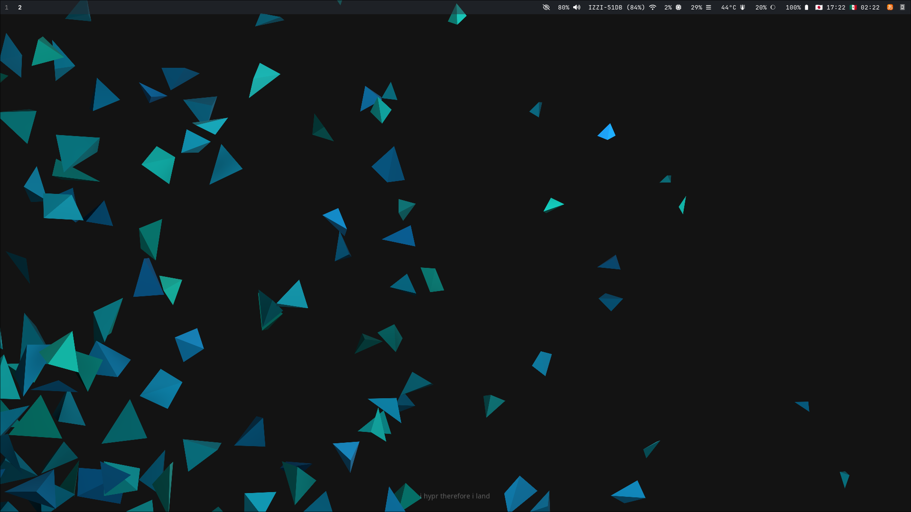
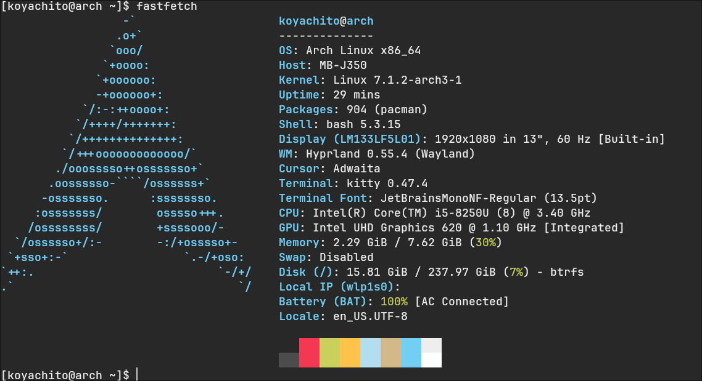

# dotfiles


## Desktop




## Fastfetch




## Resource Usage


Arch Linux をベースに構築した、再現性と保守性を重視した開発環境です。ウィンドウマネージャは Sway と Hyprland の両方に対応しています。

このリポジトリでは、設定ファイルだけでなく、環境構築スクリプトやシステム設定も Git で管理しています。

目標は「OSを再インストールしても短時間で同じ環境を復元できること」と、「自分が理解・管理できる範囲で Linux を使うこと」です。

設計思想については [Design](docs/design.md) にまとめています。

---

# 特徴

* Arch Linux + Sway / Hyprland による軽量なデスクトップ環境
* Gitで管理された再現可能な開発環境
* キーボード中心のワークフロー
* CLI / TUI を優先したソフトウェア構成
* モジュール化された設定ファイル
* シンボリックリンクによる設定管理
* systemd user service によるユーザーサービス管理
* パッケージ管理を pacman に統一し、AUR 依存を最小限に抑える構成

## ウィンドウマネージャについて

Sway と Hyprland のどちらを選んでも、同じワークフロー（キーバインド・Waybar・通知・電源メニュー）を再現できるようにしています。

Hyprland は近年人気が高いため、使いたい層がそのまま使えるように両対応としました。タイリングWMとしての有用性はどちらも変わらず、マシン負荷にもほぼ差はありません。i3 互換の安定した構成を求めるなら Sway、アニメーションや見た目のカスタマイズ性にこだわるなら Hyprland が向いています。

---

# 含まれる主なソフトウェア

## Desktop

* Sway / Hyprland
* Waybar
* Kitty
* Fuzzel
* Mako

## Development

* Neovim
* Git
* Lazygit
* Rust
* Node.js
* TypeScript
* Clang
* CMake

## CLI / TUI

* bat
* btop
* eza
* fd
* fzf
* jq
* ripgrep
* tree
* yazi
* zoxide

## Documents

* Pandoc
* Zathura
* pdfgrep
* Tesseract (日本語OCR)

## Utilities

* Bitwarden
* Thunderbird
* KDE Connect
* xremap
* brightnessctl

---

# リポジトリ構成

```text

.
├── assets/            # スクリーンショット
├── config/            # 各種設定ファイル
├── docs/              # 設計思想・導入手順ドキュメント
│   ├── design.md      # 設計思想
│   └── snapper.md     # Snapper導入手順
├── othersettings/     # system設定・設定例
├── scripts/           # 補助スクリプト
├── install-common.sh  # 共通環境の構築（WM非依存）
├── install-hypr.sh    # Hyprland 環境の構築
├── install-sway.sh    # Sway 環境の構築
├── extra.sh           # 任意アプリの追加インストール
└── README.md
```

---

# インストール

リポジトリを取得します。

```bash
git clone https://github.com/koyachito/dotfiles.git ~/dotfiles
cd ~/dotfiles
```
基本環境（WM に依存しない共通部分）を構築します。

```bash
./install-common.sh
```

続けて、使用するウィンドウマネージャのスクリプトを実行します。greetd の設定と有効化は各スクリプトの最後で行われます。どちらか一方でも、両方でも構いません。

```bash
# Hyprland を使う場合
./install-hypr.sh

# Sway を使う場合
./install-sway.sh
```

両方インストールした場合、greetd が起動するデフォルトセッションは後に実行したスクリプトの WM になります。

Steam・Discord・Spotify など任意のアプリケーションを追加する場合は、

```bash
./extra.sh
```

を実行してください。

---

# インストール内容

`install-common.sh` は WM に依存しない共通部分を設定します。

* pacman によるパッケージインストール
* Cargo パッケージのインストール
* dotfiles のシンボリックリンク作成
* systemd user service の有効化
* xremap の設定
* フォントキャッシュ更新

`install-hypr.sh` / `install-sway.sh` は各 WM 固有の部分を設定します。

* WM 本体と周辺ツールのインストール
* WM 設定・Waybar・電源メニューのシンボリックリンク作成
* greetd の設定と有効化
* インストール確認

---

# 復旧

このリポジトリを利用することで、新しい環境への移行やOS再インストール後の復旧は

1. Arch Linux をインストール
2. このリポジトリを clone
3. `install-common.sh` と、使用する WM のスクリプト（`install-hypr.sh` / `install-sway.sh`）を実行
4. 再起動

という流れで行えます。

---

# 設計思想

この環境は、

* 軽量であること
* 理解・管理できること
* キーボード中心で操作できること
* 環境を容易に再現できること

を重視して設計しています。

なぜ Arch Linux を選んだのか、タイリングWM（Sway / Hyprland）を採用した理由、ソフトウェア選定方針などについては **design.md** を参照してください。

---

# Snapper

Btrfs スナップショットには Snapper を利用しています。

初回導入手順は [snapper.md](docs/snapper.md) にまとめています。


